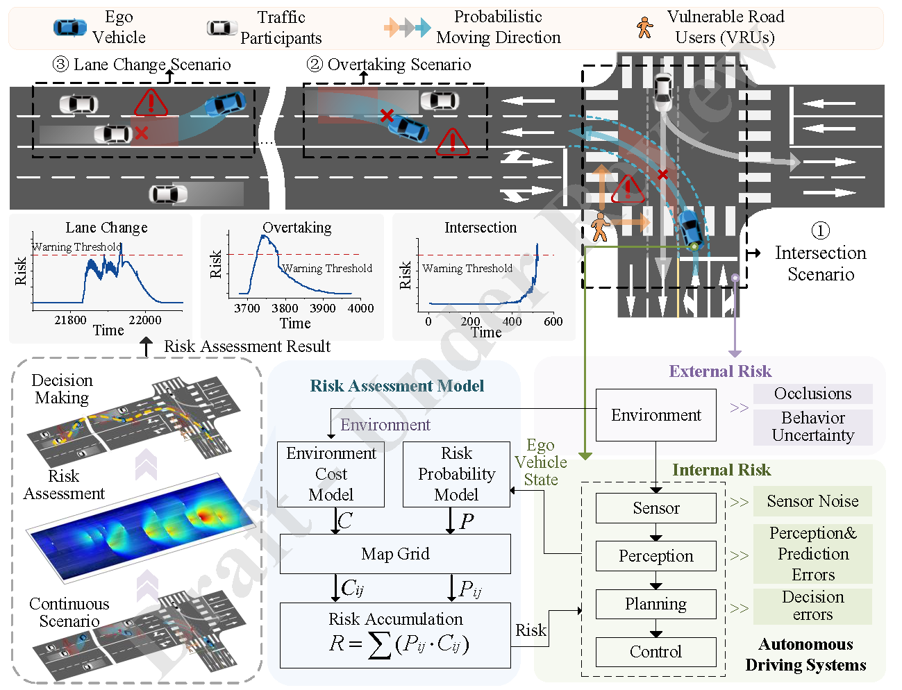

# Comprehensive Risk Assessment Model for Autonomous Driving

## Authors
- [Author 1](https://github.com/author1)
- [Author 2](https://github.com/author2)
- [Author 3](https://github.com/author3)

## Abstract
Risk assessment is crucial for quantifying driving environment risks and reducing the Safety of the Intended Functionality (SOTIF) uncertainty in autonomous driving systems. However, existing methods often focus on single-type scenarios and fail to address complex interactions involving various traffic participants and directions. Consequently, we propose a risk assessment model capable of evaluating risks across diverse traffic participants, multiple directions, and complex multi-risk scenarios. Our model integrates state information from both the ego vehicle and surrounding traffic participants to compute a comprehensive risk probability distribution and environmental impact model. By iteratively calculating the cumulative environment cost for each traffic participant and deriving a scalar risk value through sampling and summation within a map grid, our approach ensures more accurate risk quantification. We validated our model using extensive real-world datasets, including inD, highD, and rounD, to demonstrate its practical applicability. Through comparative analysis with single-scenario metrics, we confirmed the correctness of our method. Additionally, testing across various scenario types and comparing with existing single-scenario metrics highlighted the model's generalization capability. The results showed that our model accurately quantifies environmental risks, making it a robust tool for the development and deployment of safer autonomous driving systems.

## Framework Overview


*Figure 1: Overview of our proposed risk assessment model.*

## Demo

### Example 1: Highway Scenario

||
---|---|---|

*Figure 2-1: risk model in highway scenario.*

### Example 2: Intersection Scenario
||
---|---|---|

*Figure 2-2: risk model in intersection scenario.*
### Example 3: Roundabout Scenario
||
---|---|---|

*Figure 2-3: risk model in roundabout scenario.*
## Quick Start

### Prerequisites

- Python 3.8 (Tested only in Python 3.8, other versions not verified)
- Required Python packages listed in `requirements.txt`

### Installation

1. Clone the repository:
    ```bash
    git clone https://github.com/your_username/risk_assessment_model.git
    cd risk_assessment_model
    ```

2. Install required packages:
    ```bash
    pip install -r requirements.txt
    ```
    
    OR 
    
    manual install packages: numpy,scipy,pandas,matplotlib and opencv-python
    ```bash
    pip install numpy scipy pandas matplotlib opencv-python
    
    ```
3. Prepare the datasets:
    - Download the required datasets from the following sources:
        - [inD Dataset](https://www.ind-dataset.com/)
        - [highD Dataset](https://www.highd-dataset.com/)
        - [rounD Dataset](https://www.round-dataset.com/)
    - Extract the datasets to a designated directory (e.g., `data/`):
        ```bash
        mkdir data
        unzip path_to_ind_dataset.zip -d data/
        unzip path_to_highd_dataset.zip -d data/
        unzip path_to_round_dataset.zip -d data/
        ```
    - Ensure the directory structure is as follows:
        ```
        risk_assessment_model/
        ├── data/
        │   ├── inD/
        │   ├── highD/
        │   └── rounD/
        └── ...
        ```

### Quick Start

1. Run the `quick_run.py` file:
    ```python
    python quick_run.py
    ```

## Datasets

Our model was validated using the following real-world datasets:

- [inD](https://levelxdata.com/ind-dataset/)
- [highD](https://levelxdata.com/highd-dataset/)
- [rounD](https://levelxdata.com/round-dataset/)

## Contributions

We welcome contributions to enhance this project. Please fork the repository and create a pull request with your changes.

## License

This project is licensed under the MIT License - see the [LICENSE](LICENSE) file for details.

## Contact

For questions or further information, please contact [Author 1](mailto:author1@example.com), [Author 2](mailto:author2@example.com), or [Author 3](mailto:author3@example.com).
